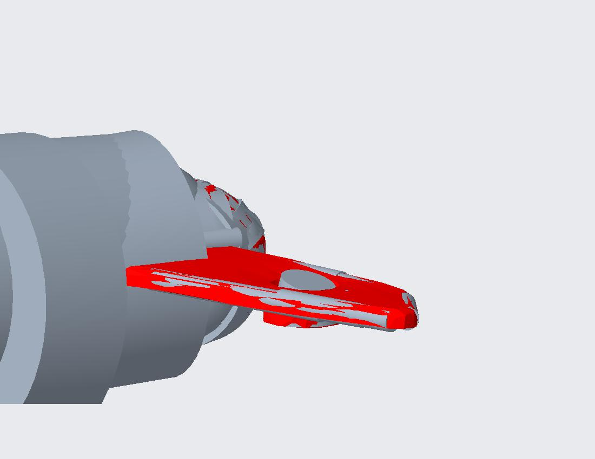

# cc-ransac-reconstruction-step
Python tools to extract RANSAC primitives from CloudCompare and reconstruct them as aligned STEP geometry for reverse engineering.
# CloudCompare RANSAC to STEP Reconstruction



This project turns CloudCompare RANSAC primitives into editable STEP geometry.  
It is intended as a compact reverse-engineering pipeline for point clouds: reconstruct the detected shapes in CloudCompare, export them as JSON, then rebuild them as separate STEP solids or faces while preserving placement and orientation.

## What this does

The workflow is split into two scripts:

- `cc_ransac_to_json.py`  
  Runs inside CloudCompare’s Python plugin. It walks the selected entity tree recursively, finds supported reconstructed shapes, reads their parameters and transformation history, and writes one JSON export.

- `json_to_step.py`  
  Runs from the command line. It reads the exported JSON and rebuilds each shape as a separate STEP entity so that parts can later be hidden or inspected individually in downstream CAD software.

The current pipeline keeps the object orientation and placement from CloudCompare. For planar primitives, the script builds a rectangular face instead of a mathematical infinite plane, because STEP export must be finite.

---

## Quick start

1. Open your point cloud in CloudCompare.
2. Run the included RANSAC_SD plugin.
3. Select the reconstructed root object or a parent node that contains the RANSAC results.
4. Run `cc_ransac_to_json.py` through CloudCompare’s Python script interface.
5. Convert the JSON to STEP with `json_to_step.py` from CMD.
6. Open the resulting STEP file in your CAD tool.

You don't need to select every primitive manually, as the scripts find all children recursively. Only selecting the created Ransac folder is enough.

---

## What you need

- CloudCompare with the Python plugin enabled
- Python for the STEP converter
- `cadquery-ocp` installed in the same Python environment used for the STEP script

Recommended Python range:
- Python 3.10 to 3.11
- Python 3.11 is a safe default and was used in the working setup

Recommended STEP backend:
- `cadquery`
- `cadquery-ocp`

I highly recommend using a **virtual environment (venv)** and not the global Python installation if you want a reproducible setup. Otherwise, naming conflicts might break the STEP reconstruction.

---

## Suggested environment setup

### 1. Create a virtual environment

```bat
py -3.11 -m venv %USERPROFILE%\ocp_clean
```

### 2. Activate it

```bat
%USERPROFILE%\ocp_clean\Scripts\activate
```

### 3. Update pip

```bat
python -m pip install --upgrade pip
```

### 4. Install the CAD backend

```bat
pip install cadquery cadquery-ocp
```

If you want a lighter install without VTK:

```bat
pip install cadquery-ocp-novtk
```

### 5. Verify the backend

```bat
python -c "import cadquery; import OCP; print('OK')"
```

---

## CloudCompare script installation

Copy the scripts into the Python scripts location used by the CloudCompare plugin, or load them from the plugin UI if your build provides a script picker.

Files:
- `cc_ransac_to_json.py`
- `json_to_step.py`

Edit `EXPORT_DIR` in `cc_ransac_to_json.py` to change the default saving location. 

---

## 1) Export from CloudCompare: `cc_ransac_to_json.py`

### Input
- A CloudCompare scene with RANSAC-detected primitives
- A single or multiple selected root objects or selected reconstructed branches

### Behavior
- traverses selected entities recursively
- processes descendants as well
- exports supported primitives only:
  - Cone
  - Cylinder
  - Plane
  - Sphere
  - Torus
- writes one JSON file

### Output
- one JSON file only
- the output path is controlled in the script header
- if the configured directory is missing or invalid, the script falls back to the Desktop

### Notes
- The exporter keeps placement and orientation by using CloudCompare’s transformation history / OpenGL transformation data.
- Do not manually expand every branch if you do not want to. Selecting the root reconstruction node is sufficient.

---

## 2) Rebuild STEP from JSON: `json_to_step.py`

Syntax:

```bat
py <script> <json> <(optional) output>
```

Example with venv (use when following the setup above):

```bat
%USERPROFILE%\ocp_clean\Scripts\python.exe json_to_step.py cc_ransac_export.json
```

### Input
- one JSON file exported by `cc_ransac_to_json.py`
- or a folder containing JSON files

### Output rules `<output>`

Default behavior if no output argument is given: `json_to_step_reconstruction.step` in current working directory

Specify a name:
- `name` or `name.step` will create the file `name.step` in the working directory

Specify a path:
- Using `\` anywhere will be treated as a relative path
- Enter a full, global path like `%USERPROFILE%\Documents` or `D:\out`

Names and paths can be compined as `path\name`. However names must include `.step` or will be treated as a path too. Place paths with spaces in brackets `"path"`.

### Result
Each exported primitive is written as a separate STEP entity so CAD software can hide or inspect elements independently. It's still only one .STEP file.

---

## How the geometry is reconstructed

### Supported primitives

- `Cone`
- `Cylinder`
- `Plane`
- `Sphere`
- `Torus`

### Parameter usage

- **Cone**  
  Height, bottom radius, top radius, apex / placement, half-angle if needed

- **Cylinder**  
  Height, radius, placement / axis

- **Sphere**  
  Radius and center

- **Torus**  
  Inner and outer radius, parsed from the exported name or stored parameters

- **Plane**  
  Local box dimensions are used to build a rectangular face instead of an infinite plane

### Transformations
The object matrix from CloudCompare is used for:
- position
- rotation
- local orientation

That is the key point of the whole pipeline: the reconstructed STEP geometry stays aligned with the original CloudCompare result.

---

## Typical workflow

1. Load the point cloud in CloudCompare.
2. Run RANSAC on the selected data.
3. Select the reconstructed result node.
4. Export JSON with `cc_ransac_to_json.py`.
5. Convert JSON to STEP with `json_to_step.py`.
6. Open the STEP file in your CAD application.
7. Use the geometry of a solid created from the source cloud as a refernece. Use the shapes to reconstruct features.

---

## Troubleshooting

### `cloudComPy` import fails
Use CloudCompare’s Python runtime, not a random external Python session. The exporter is meant to run inside CloudCompare.

### `OCP` / `OCC` import fails in `json_to_step.py`
Install the CAD backend in the same virtual environment that runs the script:

```bat
%USERPROFILE%\ocp_clean\Scripts\activate
pip install cadquery cadquery-ocp
```

### `pythonocc-core` cannot be installed
That is normal on some setups. Use `cadquery-ocp` instead.

### STEP file is not created
Check:
- current working directory
- write permissions
- output path spelling
- whether the JSON file contains exportable primitives

### Names are missing in the CAD viewer
Some STEP viewers preserve object names better than others. The script writes names into the STEP structure, but the display behavior still depends on the target application.

### `json_to_step.py` file can't be found by python

1. Open your desired working directory using the Windows Explorer.
2. Right-click and select `Open in terminal`.
3. Run commands here with local paths only, except for Python. Example:
```bat
C:\Users\YOUR_USER\ocp_clean\Scripts\python.exe json_to_step.py json_to_step_reconstruction.step
```
